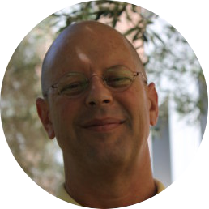
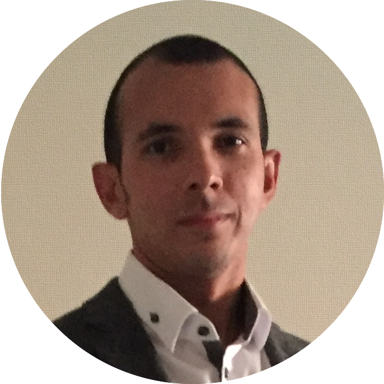

{::options parse_block_html="true" /}

The 2018 NSF Software Infrastructure for Sustained Innovation (SI2) Principal Investigator (PI) workshop will be held on **[date]** 2018 at the **[location]**.
This year, the workshop will be co-located with the 18th IEEE/ACM International Symposium on Cluster, Cloud, and Grid Computing ([CCGrid'18](https://ccgrid2018.seas.gwu.edu/)). 

    

        

            <header>
                <h2>Organizers</h2>
            </header>
            

                

                    
                    <h1>Frank Timmes (Chair)</h1>
                    
Arizona State University

                

            

            

                

                    
                    <h1>Sandra Gesing</h1>
                    
University of Notre Dame

                

                

                    
                    <h1>Namu Patel</h1>
                    
Northwestern University

                

                

                    
                    <h1>Paul Bauman</h1>
                    
University at Buffalo

                

            

            

                

                    
                    <h1>Frank Loeffler</h1>
                    
Louisiana State University

                
   
                

                    
                    <h1>Kyle Niemeyer</h1>
                    
Oregon State University

                
             
                

                    
                    <h1>Rafael Ferreira da Silva</h1>
                    
University of Southern California

                
             
            

        

    

<section class="wrapper style1 container special" markdown="0">
    <header class="major">
       <h2>Past Meetings</h2>
    </header>
    

        

            <h3>2017 SI2 PI Meeting</h3>
            
Arlington, VA – 21-22 Feb 2017

            
<a href="https://si2-pi-community.github.io/2017-meeting/" target="_blank"><i class="fa fa-external-link"></i>&nbsp;&nbsp;Website</a>

        

        

            <h3>2016 SI2 PI Meeting</h3>
            
Arlington, VA – 16-17 Feb 2016

            

                <a href="http://cococubed.asu.edu/si2_pi_workshop_2016/" target="_blank"><i class="fa fa-external-link"></i>&nbsp;&nbsp;Website</a>
                &nbsp;&nbsp;
                <a href="http://dl.acm.org/citation.cfm?id=2965630" target="_blank"><i class="fa fa-file-o"></i>&nbsp;&nbsp;Report</a>
             

        

        

            <h3>2015 SI2 PI Meeting</h3>
            
Arlington, VA – 17-18 Feb 2015

            

                <a href="http://cococubed.asu.edu/si2pimeeting2015/" target="_blank"><i class="fa fa-external-link"></i>&nbsp;&nbsp;Website</a>
                &nbsp;&nbsp;
                <a href="http://cococubed.asu.edu/si2_pi_workshop_2016/ewExternalFiles/nsf-si2piw_2015.pdf" target="_blank"><i class="fa fa-file-o"></i>&nbsp;&nbsp;Report</a>
            

        

    

    

        

            <h3>2014 SI2 PI Meeting</h3>
            
Arlington, VA – 24-25 Feb 2014

            

                <a href="https://sites.google.com/site/si2pimeeting2014/" target="_blank"><i class="fa fa-external-link"></i>&nbsp;&nbsp;Website</a>
                &nbsp;&nbsp;
                <a href="http://hdl.handle.net/2022/19760" target="_blank"><i class="fa fa-file-o"></i>&nbsp;&nbsp;Report</a>
            

        

        

            <h3>2013 SI2 PI Meeting</h3>
            
Arlington, VA – 17-18 Jan 2013

            

                <a href="https://sites.google.com/site/si2pimeeting/home" target="_blank"><i class="fa fa-external-link"></i>&nbsp;&nbsp;Website</a>
                &nbsp;&nbsp;
                <a href="http://dl.acm.org/citation.cfm?id=2747420" target="_blank"><i class="fa fa-file-o"></i>&nbsp;&nbsp;Report</a>
            

        

    

</section>
